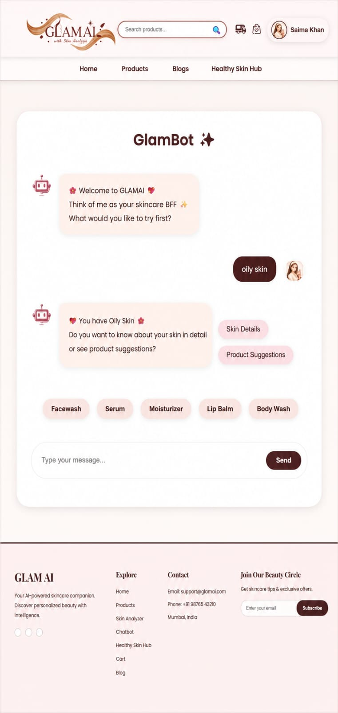

# GLAM AI : E-Commerce with AI Skin-Analyzer

## AI-Powered Skincare Intelligence Platform

GlamAI is a full-stack AI-powered skincare platform that combines Artificial Intelligence, Computer Vision, Conversational AI, and Modern E-Commerce to deliver personalized skincare experiences.

Users can analyze their skin through AI-powered image processing, receive personalized skincare recommendations, interact with an intelligent chatbot, explore skincare products, complete secure online purchases, and track their orders through a seamless digital experience.

---

## Key Features

### Artificial Intelligence

* AI-Based Skin Type Detection
* TensorFlow + MobileNetV2 Transfer Learning
* OpenCV Image Processing Pipeline
* Sensitive Skin Detection using Redness Analysis
* Real-Time Skin Analysis

### Smart Recommendations

* Personalized Product Recommendations
* Skin-Type Specific Product Suggestions
* Customized Skincare Guidance

### E-Commerce Features

* Product Catalog
* Product Search & Filtering
* Shopping Cart
* Secure Checkout System
* Razorpay Payment Integration
* Order Tracking

### User Experience

* Google Authentication
* JWT Secure Authentication
* AI Chatbot Assistant
* Healthy Skin Hub
* Blog & Educational Content

### Administration

* Admin Dashboard
* Product Management
* Order Management
* User Management

---

## Technology Stack

### Frontend

* React.js
* Tailwind CSS
* JavaScript
* HTML5
* CSS3

### Backend

* Node.js
* Express.js

### Artificial Intelligence

* TensorFlow
* MobileNetV2
* OpenCV
* Flask
* NumPy

### Database

* MongoDB

### Authentication

* Google OAuth
* JWT Authentication

### Payment Gateway

* Razorpay

---

## AI Workflow

Face Image Upload

↓

OpenCV Preprocessing

↓

MobileNetV2 Deep Learning Model

↓

Skin Type Prediction

↓

Personalized Recommendations

↓

Product Suggestions

---

## Supported Skin Types

* Dry
* Oily
* Normal
* Sensitive
* Combination

---

## Project Showcase

### Landing Page

### Home Page

### AI Skin Analyzer

### AI Chatbot

### Product Catalog

### Secure Payment Integration

.jpeg)

### Order Tracking

### Healthy Skin Hub

### Blog Section

### Admin Dashboard

---

## Project Vision

To make intelligent skincare guidance accessible through Artificial Intelligence, Computer Vision, and Personalized Digital Experiences.

---

## Author

**Saima Khan**

AI & Full-Stack Developer

React.js | Node.js | MongoDB | Python | TensorFlow | Computer Vision

